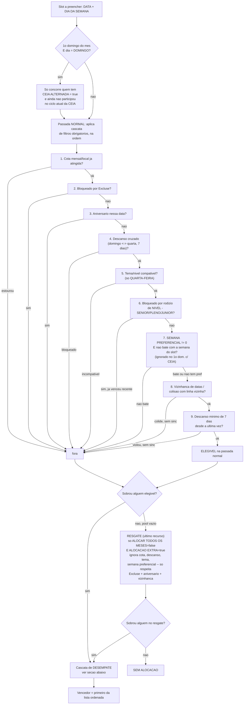

# Como a prioridade decide quem é alocado

Este documento explica, passo a passo, como o motor decide quem ocupa cada
vaga (slot) — ou seja, a ordem exata em que as regras são aplicadas. Serve de
referência rápida para não precisar reler `motor.py` toda vez.

**Duas etapas bem diferentes, nessa ordem:**

1. **Filtros obrigatórios (elegibilidade)** — decidem QUEM PODE concorrer.
   Quem não passa aqui é descartado por completo, não importa a prioridade
   cadastrada.
2. **Cascata de desempate (ordenação)** — só entra em jogo DEPOIS, para
   decidir, entre quem sobrou, quem vence.

Isso é a diferença central: prioridade (e semana preferencial, e semana
alternada) **não filtram elegibilidade** — elas só desempatam entre quem já
é elegível. Quem filtra elegibilidade são os filtros obrigatórios da etapa 1.

## Workflow completo (por slot)

## Etapa 1 — Filtros obrigatórios (na ordem em que o código aplica)

Aplicados dentro de `avaliar_candidatos_para_slot`, passada normal (função
`_avaliar_e_escolher` em `motor.py`). Qualquer um destes elimina o candidato
por completo — ele nem chega na cascata de desempate:

1. **CEIA ALTERNADA** (só no 1º domingo do mês em DOMINGO): quem tem
   `ceia_alternada=False`, ou já participou no ciclo atual da CEIA, é excluído.
   Ver [[CONCEITO_CEIA_ALTERNADA]].
2. **Cota mensal/local**: já usou a cota do mês (`cota_base`, ou o limite
   calculado pela onda expansiva)? Fora.
3. **Excluse**: bloqueio explícito cadastrado na aba `Excluse` para
   aquele NOME + DEPARTAMENTO + FUNÇÃO + data. Fora.
4. **Aniversário**: dia/mês da data bate com a data de nascimento? Fora.
5. **Descanso cruzado** (domingo↔quarta, 7 dias): serviu como MINISTRO no
   outro dia da semana há menos de 7 dias? Fora.
6. **Compatibilidade de tema/nível** (só QUARTA-FEIRA): o `TEMA` cadastrado
   do colaborador precisa bater exatamente com o nível exigido pelo slot
   (SENIOR/PLENO/JUNIOR, calculado a partir da lição da semana). Não bate?
   Fora.
7. **Rodízio por nível**: mesmo dentro do nível certo, quem venceu
   recentemente nesse nível (dentro da janela = tamanho do nível − 1) fica
   bloqueado até todos os outros do mesmo nível já terem sido escalados.
8. **SEMANA PREFERENCIAL**: fora do 1º domingo sujeito a CEIA ALTERNADA, se o
   colaborador tem `semana_preferencial != 0` e a semana do slot **não**
   bate com essa preferência, ele é excluído — não concorre àquela vaga de
   jeito nenhum. Só concorre nas semanas que batem com a preferência dele (ou em
   qualquer semana, se `semana_preferencial == 0`). No 1º domingo com CEIA ALTERNADA,
   a CEIA sobrepõe a semana preferencial (candidatos da CEIA com semana != 1 não
   são excluídos, pois o ciclo da CEIA tem precedência).
9. **Vizinhança de datas / colisão de linha vizinha**: mesma pessoa em
   linhas adjacentes da agenda (a menos que tenha `sinc_colaborador`
   natural apontando pra lá).
10. **Descanso mínimo de 7 dias** desde a última vez que serviu (a menos que
    tenha `sinc_colaborador` forçando a sincronia).

Se **ninguém** sobreviver a essa cascata, o motor tenta o **RESGATE**
(`ignorar_vizinhanca_e_descanso=True`): pool restrito a quem tem
`ALOCAR TODOS OS MESES=false` **e** `ALOCAÇÃO EXTRA=true`, e dentro desse
pool só valem Excluse + aniversário + vizinhança — cota mensal, descanso
mínimo, tema/nível **e semana preferencial não bloqueiam no resgate**. É a
única situação em que alguém pode ser alocado fora da semana que pediu — e
só como último recurso, quando não sobra mais ninguém elegível na passada
normal.

## Etapa 2 — Cascata de desempate (`chave_ordenacao_candidato`)

Só entre quem sobreviveu à etapa 1 (normal ou resgate). Ordena do "melhor"
pro "pior" nesta ordem exata — cada critério só desempata quando o(s)
anterior(es) empataram:

| # | Critério | Como funciona |
|---|---|---|
| 1 | **Reserva de CEIA** | Se a função tem restrição de CEIA e o slot NÃO é a CEIA, quem tem `ceia_alternada=True` é empurrado pra trás — reservado pra vaga de CEIA em vez de "gasto" num domingo comum. |
| 2 | **SEMANA PREFERENCIAL (rank)** | No 1º domingo com CEIA ALTERNADA, este critério é neutralizado (rank 0 para todos os candidatos da CEIA, permitindo que a PRIORIDADE ordene o ciclo). Nos demais casos: 3 níveis: **0** = pediu exatamente esta semana (vence sempre); **1** = não tem preferência cadastrada (neutro); **2** = pediu outra semana, só chega aqui via resgate. Rank 0 sempre vence rank 1, mesmo que a prioridade cadastrada dele seja pior. |
| 3 | **SEMANA ALTERNADA** | Quem tem `semana_alternada=True` e não respeitou o descanso mínimo desde a última vez é penalizado (empurrado pro fim). |
| 4 | **PRIORIDADE** | Número cadastrado (`PRIORIDADE`, menor = melhor). **Só decide quando os 3 critérios acima empataram** (ou no 1º domingo de CEIA, onde rank de preferência é neutro). |

Ou seja: **PRIORIDADE é o critério de desempate de MENOR peso** dos quatro
ativos hoje — só é consultado quando ninguém se destacou por CEIA, SEMANA
PREFERENCIAL ou SEMANA ALTERNADA. Isso é intencional (pedido do Clayton em
2026-09-08): antes, SEMANA PREFERENCIAL era só um booleano de
"violou/não violou", e dois candidatos empatados nesse booleano (um que
pediu a semana e bateu, outro que não tem preferência nenhuma) caíam direto
pra PRIORIDADE — ignorando que um deles pediu aquela semana especificamente.
Agora quem bate a preferência vence sempre, independente da prioridade.

### Por que isso garante o comportamento de "ALOCAR TODOS OS MESES + preferência = sempre o primeiro escolhido"

Combinando a etapa 1.8 (filtro obrigatório) com a etapa 2.2 (rank 0 sempre
vence): quem tem `ALOCAR TODOS OS MESES=true` e uma `SEMANA PREFERENCIAL`
cadastrada:

- **Nunca** é considerado fora da semana que pediu (etapa 1.8 o exclui).
- **Sempre** vence dentro da semana que pediu, contra qualquer outro
  candidato sem essa preferência específica (etapa 2.2, rank 0 > rank 1) —
  a menos que outro filtro obrigatório da etapa 1 (Excluse, aniversário,
  tema/nível, descanso, rodízio de nível, vizinhança) o bloqueie primeiro,
  caso em que ele nem chega na etapa 2 e outra pessoa é alocada.

Não precisou de código específico pra "ATM = garantido" — é consequência
direta de combinar o filtro obrigatório com o rank de desempate.

## Critérios desativados (comentados no código, não apagados)

Existiam mais critérios na cascata de desempate antes da revisão pedida
pelo Clayton em 2026-09-06 (sincronismo, crédito do mês anterior, "ainda não
usou ALOCAR TODOS OS MESES este mês", zumbi prioritário em QUARTA, histórico
total de alocações, sorteio aleatório de empate final). Ficam comentados em
`chave_ordenacao_candidato`, prontos para reativar quando a revisão dos 4
critérios principais (CEIA / SEMANA PREFERENCIAL / SEMANA ALTERNADA /
PRIORIDADE) estiver validada em produção.

## Referências

- [[CONCEITO_CEIA_ALTERNADA]] — detalha o filtro/fase de CEIA e as 4 fases
  de `alocar_grupo` para grupos DOMINGO.
- [[CONCEITO_CICLO]] — conceito de rotação/ciclo em que as Rondas se
  encaixam.
- `src/pastoreio_orquestrador/motor.py`: `avaliar_candidatos_para_slot`
  (etapa 1), `chave_ordenacao_candidato` (etapa 2), `_avaliar_e_escolher`
  (junta as duas + resgate).
